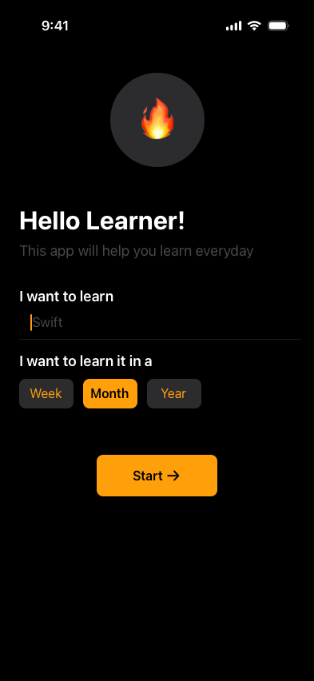

# Learning App 📘

An **iOS application** built with **SwiftUI** to help users build consistent learning habits.  
It allows setting personalized goals, tracking daily progress, and maintaining streaks with a “freeze” feature for busy days — keeping users motivated without losing momentum.

---

## 🎯 Purpose
Learning App turns learning into a **structured, trackable habit**.  
With visual progress tracking, streak management, and flexible goal durations, it supports both short-term skill building and long-term education goals.

---

## 🌟 Key Features
- **Set Learning Goals** – Define specific objectives for any skill or subject.  
- **Track Progress** – Interactive calendar view to log learning days and monitor streaks.  
- **Freeze Mode** – Pause streaks during breaks without losing progress.  
- **Custom Timeframes** – Weekly, monthly, or yearly goal durations.

---

## 🛠️ Technical Details
- **Language**: Swift  
- **Framework**: SwiftUI  
- **Core Features**:  
  - State management  
  - Calendar-based UI  
  - Local data persistence  
- **Tools**: Xcode, iOS Simulator

---
## 📸 Screenshots
### Onboarding Screen

### Current day

### Learned today

